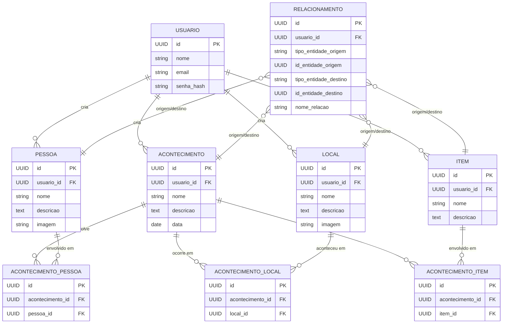

# InvestiTrace API

## Diagrama Entidade-Relacionamento

```mermaid
erDiagram
    USUARIO ||--o{ PESSOA : "cria"
    USUARIO ||--o{ LOCAL : "cria"
    USUARIO ||--o{ ITEM : "cria"
    USUARIO ||--o{ ACONTECIMENTO : "cria"

    PESSOA {
        UUID id PK
        UUID usuario_id FK
        string nome
        text descricao
        string imagem
    }

    LOCAL {
        UUID id PK
        UUID usuario_id FK
        string nome
        text descricao
        string imagem
    }

    ITEM {
        UUID id PK
        UUID usuario_id FK
        string nome
        text descricao
    }

    ACONTECIMENTO {
        UUID id PK
        UUID usuario_id FK
        string nome
        text descricao
        date data
    }

    ACONTECIMENTO ||--o{ ACONTECIMENTO_PESSOA : "envolve"
    PESSOA ||--o{ ACONTECIMENTO_PESSOA : "envolvido em"
    ACONTECIMENTO_PESSOA {
        UUID id PK
        UUID acontecimento_id FK
        UUID pessoa_id FK
    }

    ACONTECIMENTO ||--o{ ACONTECIMENTO_ITEM : "envolve"
    ITEM ||--o{ ACONTECIMENTO_ITEM : "envolvido em"
    ACONTECIMENTO_ITEM {
        UUID id PK
        UUID acontecimento_id FK
        UUID item_id FK
    }

    ACONTECIMENTO ||--o{ ACONTECIMENTO_LOCAL : "ocorre em"
    LOCAL ||--o{ ACONTECIMENTO_LOCAL : "aconteceu em"
    ACONTECIMENTO_LOCAL {
        UUID id PK
        UUID acontecimento_id FK
        UUID local_id FK
    }

    RELACIONAMENTO {
        UUID id PK
        UUID usuario_id FK
        string tipo_entidade_origem
        UUID id_entidade_origem
        string tipo_entidade_destino
        UUID id_entidade_destino
        string nome_relacao
    }

    RELACIONAMENTO }o--|| PESSOA : "origem/destino"
    RELACIONAMENTO }o--|| LOCAL : "origem/destino"
    RELACIONAMENTO }o--|| ITEM : "origem/destino"
    RELACIONAMENTO }o--|| ACONTECIMENTO : "origem/destino"

    USUARIO {
        UUID id PK
        string nome
        string email
        string senha_hash
    }

```
